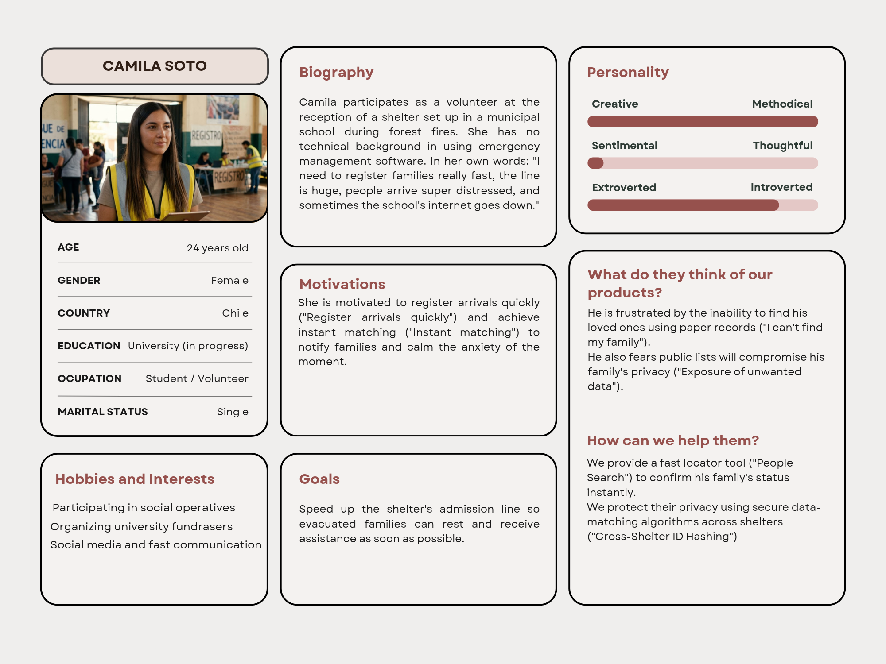
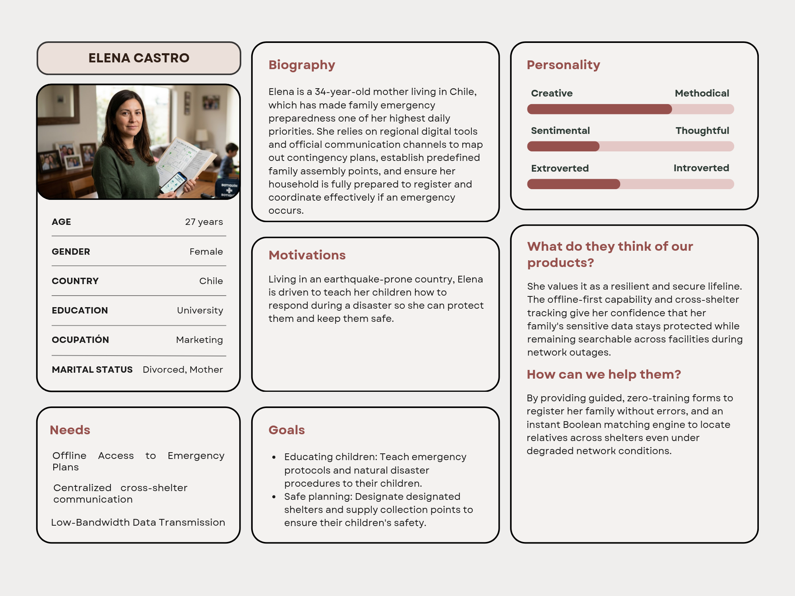
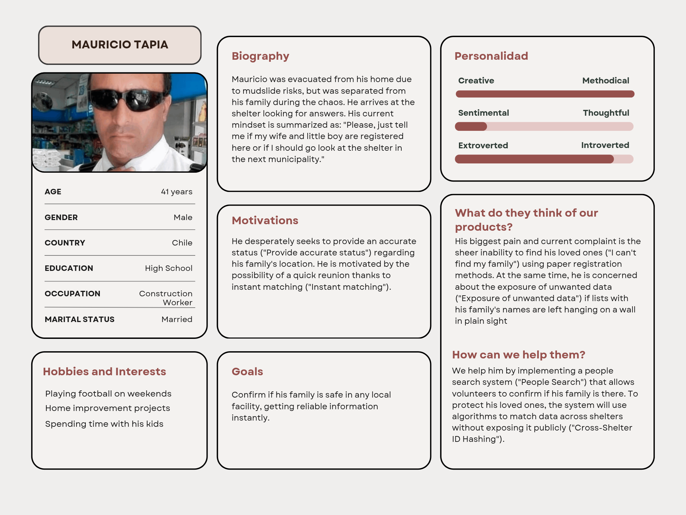
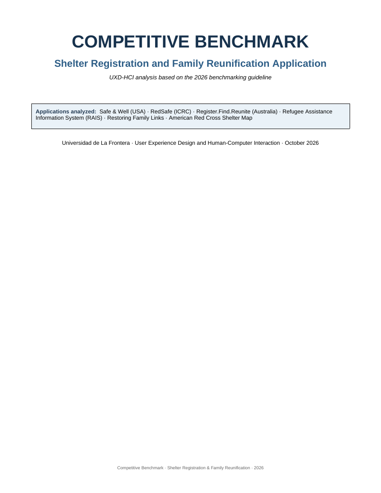
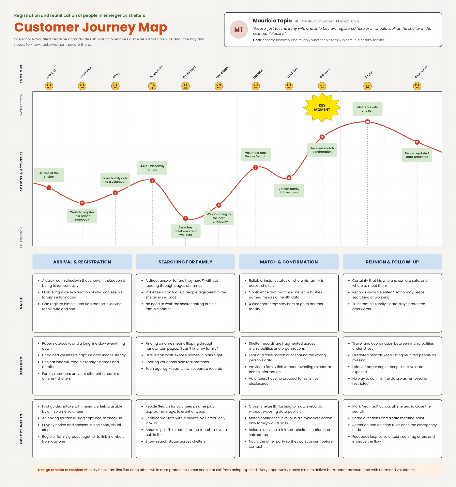

# UX-2026_2
>

**Course:** Diseño de Experiencia de Usuario e Interacción Humano Computador — UXD-HCI 2026  
**Department:** Departamento de Cs. Computación e Informática  
**University:** Universidad de La Frontera (UFRO), Temuco, Chile

---

## Index
1. [Introduction](#1-introduction)
   - [1.1. The Problem](#11-the-problem)
2. [Team & Roles](#2-team--roles)
3. [Strategy](#3-strategy)
   - [3.1 Value Proposition Canvas](#31-value-proposition-canvas)
   - [3.2 UX Personas](#32-ux-personas)
   - [3.3 Benchmark Analysis](#33-benchmark-analysis)
   - [3.4 Customer Journey Map](#34-customer-journey-map)
- [Repository Contents](#repository-contents)
  - [Folder Breakdown](#folder-breakdown)
<!--

4. [Scope](#4-scope)
   - [4.1. Functional Requirements](#41-functional-requirements)
   - [4.2. Restrictions](#42-restrictions)
   - [4.3. Navigation Patterns](#43-navigation-patterns-adopted-from-benchmark)
5. [Structure](#5-structure)
   - [5.1. Navigation Flow](#51-navigation-flow)
6. [Skeleton](#6-skeleton)
   - [6.1. Low-Fi Wireframes](#61-low-fi-wireframes)
7. [Surface](#7-surface)
   - [7.1. Interface Evolution](#71-interface-evolution)
   - [7.2. Heuristic Evaluation](#72-heuristic-evaluation)
   - [7.3. Accessibility](#73-accessibility)
   - [7.4. High Definition Interfaces](#74-high-definition-interfaces)
8. [Annex](#8-annex)

-->
---

## 1. Introduction
### 1.1. The Problem
After a fire or flood, shelters register people in notebooks. There are separated families, sensitive data—health information, details about minors—and several agencies operating in parallel. The system must function under pressure, with untrained volunteer staff, and resolve an explicit tension between visibility, which facilitates reunification, and data protection, which avoids exposing people at risk.
> *"As a volunteer in charge of registering at a shelter, I need to quickly register arriving families and be able to respond if a person is here, without publishing information that exposes minors or people at risk."*

---

## 2. Team & Roles
| Name | Role |
|---|---|
| **Eduardo Gómez** | Project Lead & Designer |
| **Maximiliano Rivas** | Designer |
| **José Rivera** | Designer |

---

## 3. Strategy
> *LOREM IPSUM*

### 3.1 Value Proposition Canvas

📄 [Value Proposition Canvas](Tareas/Value-Proposition-Canvas/%20Value_Proposition_Canvas_EN.pdf)


---

### 3.2. UX Personas

Three personas were identified based on field context and the user story provided for the project scenario. Each persona represents a distinct user type with unique needs, frustrations, and technology usage patterns.

#### 👤 Camila Soto — Shelter Volunteer
> *"I need to register families really fast, the line is huge, people arrive super distressed, and sometimes the school's internet goes down."*

- 24 years old · Chile · University (in progress), Student / Volunteer
- **Key need:** Speed up the shelter's admission line so evacuated families can rest and receive assistance as soon as possible.
- **Main frustration:** The inability to find loved ones using paper records and the exposure of unwanted data via public lists.

#### 👤 Elena Castro — Concerned Mother
> *"Living in an earthquake-prone country, [I am] driven to teach [my] children how to respond during a disaster so [I] can protect them and keep them safe."*

- 27 years old · Chile · University, Marketing
- **Key need:** Offline access to emergency plans and centralized cross-shelter communication.
- **Main frustration:** The risk of sensitive family data becoming compromised or inaccessible during network outages across facilities.

#### 👤 Mauricio Tapia — Evacuated Father
> *"Please, just tell me if my wife and little boy are registered here or if I should go look at the shelter in the next municipality."*

- 41 years old · Chile · High School, Construction Worker
- **Key need:** Confirm if his family is safe in any local facility by getting reliable information instantly.
- **Main frustration:** The sheer inability to find his loved ones using paper registration methods and the exposure of unwanted data if lists are left hanging on a wall in plain sight.





---

### 3.3 Benchmark Analysis

The competitive benchmark identifies domain standards, experience gaps, and differentiation opportunities for a solution that lets people be registered in shelters, searched across multiple locations, and safely reconnected with relatives during emergencies. It follows the 2026 UXD-HCI benchmarking guideline and was completed in October 2026.

📄 [Competitive Benchmark – Shelter Registration & Family Reunification (PDF, 15 pages)](Tareas/Benchmatk/Benchmark_Competitive_Shelter_Reunification_EN.pdf)

[](Tareas/Benchmatk/Benchmark_Competitive_Shelter_Reunification_EN.pdf)

#### Tool Selection & Justification

Six tools were analyzed. The guideline recommends 3–5 tools, but all six are retained because each covers a distinct part of the problem space: status registration, family tracing, institutional case management, privacy, and shelter discovery.

| # | Tool | Category | Justification |
|---|---|---|---|
| 1 | **Safe & Well** — American Red Cross (USA) | Direct competitor | Disaster status registration and family lookup; closest match to the "I am safe / find someone" flow. |
| 2 | **RedSafe** — ICRC | Analog competitor / design reference | Secure services, messaging, maps, and partial offline use; valuable for privacy and progressive-access patterns. |
| 3 | **Register.Find.Reunite** — Australian Red Cross | Direct competitor | Combines registration, search, and permission-based reunification during declared emergencies. |
| 4 | **RAIS** — UNHCR | Analog competitor / institutional reference | Shows how humanitarian organizations structure case management, assistance, referrals, and reporting across multiple actors. |
| 5 | **Restoring Family Links** — ICRC / Family Links Network | Direct humanitarian service | Focuses on tracing missing relatives, confidentiality, consent, and human mediation. |
| 6 | **American Red Cross Shelter Map** | Design reference | Direct geographic pattern for discovering shelters and disaster services without signing in. |

#### Analysis Dimensions

Every tool is evaluated against ten base dimensions from the guideline — identification, target user profile, value proposition, main features, onboarding flow, navigation patterns, visual design and consistency, observable accessibility, notable strengths, and areas for improvement — plus four domain-specific dimensions:

- **Low-connectivity operation:** offline use, downloadable content, or alternative channels when the Internet fails.
- **Time to critical action:** how many conceptual steps separate the user from "register," "search," or "find a shelter."
- **Privacy and consent:** who can see data, what is shared, and how a person-to-person connection is authorized.
- **Coordination across shelters / institutions:** ability to consult, transfer, or coordinate information between sites, organizations, or teams.

#### Key Findings

- **Cross-cutting finding:** the strongest references separate the immediate action (register, search, or locate a service) from sensitive processes such as identity verification, consent, case management, and inter-institutional coordination.
- **Main differentiation opportunity:** no observed solution combines, in one public-and-operational experience, shelter registration, cross-shelter search, shelter mapping, transfer history, matching tolerant of incomplete data, and offline operation.
- **Priority opportunities:** (1) unify registration, search, and shelter map; (2) maintain transfer history without exposing sensitive locations; (3) match across multiple attributes with human verification; (4) support offline-first workflows for shelter staff.

#### Design Decisions

| Decision | Adopt / Reject | Rationale |
|---|---|---|
| Two visible critical actions ("Register person" / "Search person") | ✅ Adopt | From Safe & Well and Register.Find.Reunite: reduces cognitive load under stress. |
| Progressive access | ✅ Adopt | From RedSafe: basic public functions without an account; sensitive operations require authentication or a role. |
| Consent before sharing location/contact | ✅ Adopt | From Register.Find.Reunite and Restoring Family Links: a match must not automatically expose sensitive details. |
| Human mediation for uncertain cases | ✅ Adopt | From Restoring Family Links: complex or high-risk matches are escalated to authorized staff. |
| Shelter map + list | ✅ Adopt | From the Shelter Map: find services by proximity and type, with a list alternative. |
| Modular management and roles | ✅ Adopt with simplification | From RAIS: separate cases, shelters, search, and reports without building an overly dense administrative console. |
| Exclusive dependence on Internet | ❌ Reject | Disaster conditions require local registration and later synchronization. |
| Public directory of people | ❌ Reject | Creates privacy, violence, stalking, and misuse risks; search must be scoped and auditable. |
| Automatic definitive match | ❌ Reject | The system should suggest candidates; human verification and consent complete the reunification. |

#### Limitations

- RAIS requires credentials, so its internal screens could only be analyzed through public modules and official documentation.
- Register.Find.Reunite operates only during declared emergencies, so its operational flow depends on official material.
- Accessibility observations are "observable" only and do not replace a technical WCAG audit.

The full report also includes the comparative feature map, a synthetic comparison table against the group proposal, the proposed functional scope, two additional journey maps (a relative searching for a person and a shelter staff member), and the list of sources.

---

### 3.4 Customer Journey Map

The Customer Journey Map follows **Mauricio Tapia**, the evacuated father from the [UX personas](#32-ux-personas). After being evacuated because of mudslide risk, he reaches a shelter without his wife and little boy and needs to know, quickly, whether they are there. His goal is to confirm instantly and reliably whether his family is safe in a nearby facility.

📄 [Customer Journey Map – Mauricio (PDF)](Tareas/customer-journey-map/Customer%20Journey%20Map%20%E2%80%93%20Mauricio.pdf)

[](Tareas/customer-journey-map/Customer%20Journey%20Map%20%E2%80%93%20Mauricio.pdf)

#### Stages, Actions & Emotions

The journey has four stages and eleven actions, each paired with an emotion on a satisfaction/frustration curve.

| Stage | Actions & activities | Emotions |
|---|---|---|
| **Arrival & Registration** | 1. Arrives at the shelter<br>2. Waits to register in a paper notebook<br>3. Gives family data to a volunteer | Anxious → Impatient → Wary |
| **Searching for Family** | 4. Asks if his family is here<br>5. Searches notebooks and wall lists<br>6. Weighs going to the next municipality | Desperate → Frustrated → Uncertain |
| **Match & Confirmation** | 7. Volunteer runs People Search<br>8. Verifies family link securely<br>9. Receives match confirmation | Hopeful → Cautious → Relieved |
| **Reunion & Follow-up** | 10. Meets his wife and son<br>11. Record updated, data protected | Joyful → Reassured |

**Key moment:** action 9, receiving the match confirmation, is where frustration turns into relief; satisfaction peaks at action 10, when he meets his wife and son.

#### Value, Barriers & Opportunities

| Stage | Value | Barriers | Opportunities |
|---|---|---|---|
| **Arrival & Registration** | A quick, calm check-in; a plain-language explanation of who can see his family's information; he can register himself and flag that he is looking for his wife and son. | Paper notebooks and a long line slow everything down; untrained volunteers capture data inconsistently; unclear who will read his family's details; family members arrive at different times or shelters. | Fast guided intake with minimum fields; a "looking for family" flag at check-in; privacy notice and consent in one short visual step; register family groups together from day one. |
| **Searching for Family** | A direct answer to "are they here?" without reading pages of names; volunteers can look people up in seconds. | Finding a name means flipping through handwritten pages; lists on walls expose names in plain sight; spelling variations hide real matches; each agency keeps separate records. | People Search for volunteers (name plus approximate age, tolerant of typos); replace wall lists with a private, volunteer-only lookup; answer "possible match" or "no match," never a public list; show search status across shelters. |
| **Match & Confirmation** | Reliable, instant status of where his family is across shelters; confidence that matching never publishes names, minors, or health data; a clear next step. | Records fragmented across municipalities and organizations; fear of a false match or of sharing the wrong person's data; proving a family link without revealing minors' or health information; no protocol for sensitive disclosures. | Cross-Shelter ID Hashing to match records without exposing data; match confidence level plus a simple verification only family would pass; release only the minimum (shelter location and safe status); notify the other party so they can consent before contact. |
| **Reunion & Follow-up** | Certainty that his wife and son are safe and where to meet them; records show "reunited" so nobody keeps searching; trust that the data stays protected. | Travel and coordination between municipalities under stress; outdated records keep listing reunited people as missing; leftover paper copies keep data exposed; no way to confirm the data was removed or restricted. | Mark "reunited" across all shelters to close the search; share directions and a safe meeting point; retention and deletion rules once the emergency ends; a feedback loop so volunteers can flag errors. |

> **Design tension to resolve:** visibility helps families find each other, while data protection keeps people at risk from being exposed. Every opportunity above aims to deliver both, under pressure and with untrained volunteers.

---

## Repository Contents

```text
.
├── README.md
└── Tareas/
    ├── Value-Proposition-Canvas/
    │   └──  Value_Proposition_Canvas_EN.pdf
    ├── UX-personas/
    │   ├── UX Person.pdf
    │   ├── camila-soto.png
    │   ├── elena-castro.png
    │   └── mauricio-tapia.png
    ├── Benchmatk/
    │   ├── Benchmark_Competitive_Shelter_Reunification_EN.pdf
    │   └── benchmark-cover.png
    └── customer-journey-map/
        ├── Customer Journey Map – Mauricio.pdf
        └── customer-journey-map.png
```

### Folder Breakdown

| Path | What it contains | Description |
|---|---|---|
| `README.md` | Project documentation | Project overview: the problem, team, and every completed strategy activity (sections 1–3). |
| `Tareas/` | Course deliverables | Parent folder with one subfolder per completed activity of the UXD-HCI course. |
| `Tareas/Value-Proposition-Canvas/` | `Value_Proposition_Canvas_EN.pdf` | One-page Value Proposition Canvas ([section 3.1](#31-value-proposition-canvas)). |
| `Tareas/UX-personas/` | `UX Person.pdf`, `camila-soto.png`, `elena-castro.png`, `mauricio-tapia.png` | The three UX personas ([section 3.2](#32-ux-personas)): a three-page PDF with one sheet per persona, plus one PNG image for each. |
| `Tareas/Benchmatk/` | `Benchmark_Competitive_Shelter_Reunification_EN.pdf`, `benchmark-cover.png` | The 15-page Competitive Benchmark report ([section 3.3](#33-benchmark-analysis)) and a preview image of its cover. |
| `Tareas/customer-journey-map/` | `Customer Journey Map – Mauricio.pdf`, `customer-journey-map.png` | Customer Journey Map for Mauricio Tapia ([section 3.4](#34-customer-journey-map)) and a PNG preview that displays directly on GitHub. |

> New activities should be added as a new subfolder inside `Tareas/`, and this section updated to match.


